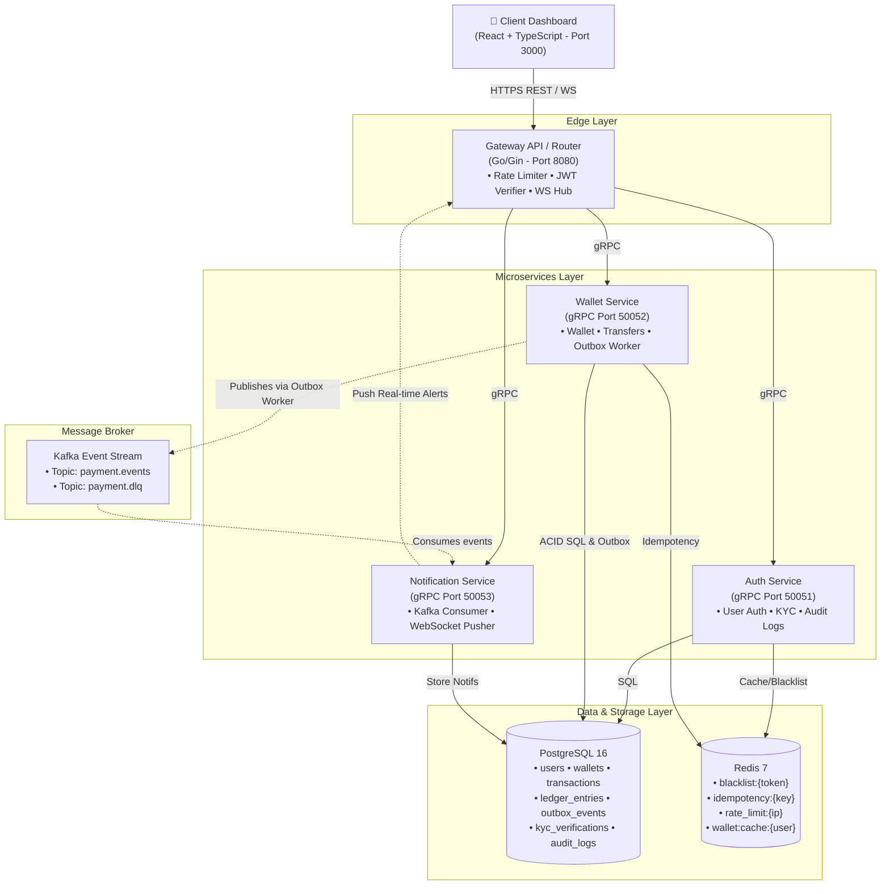
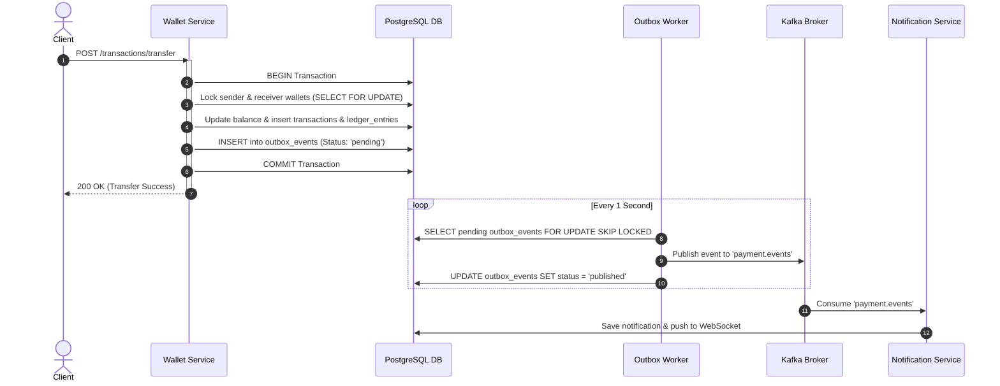

# 🏗️ Bastion — System Architecture & Design Patterns

> **Source**: Derived from [prd.md](file:///c:/Projects/bastion/context/prd.md), [features.md](file:///c:/Projects/bastion/context/features.md), & [database_design.md](file:///c:/Projects/bastion/context/database_design.md)
> **Pattern Focus**: Microservices, Event-Driven Architecture, Transactional Outbox, Clean Architecture

---

## 1. System Component Diagram



---

## 2. Clean Architecture Pattern (Service Level)

Every microservice in Bastion follows strict **Clean Layered Architecture** to maintain separation of concerns, testability, and independence from external drivers.

```
┌─────────────────────────────────────────────────────────────┐
│                    1. Handler / Transport                   │
│   (HTTP Gin Handlers / gRPC Protobuf Handlers / Consumers)  │
└──────────────────────────────┬──────────────────────────────┘
                               │ Calls
┌──────────────────────────────▼──────────────────────────────┐
│                    2. Service / Business                    │
│      (Core Domain Logic, Validations, Workflow Controls)     │
└──────────────────────────────┬──────────────────────────────┘
                               │ Calls (via Interfaces)
┌──────────────────────────────▼──────────────────────────────┐
│                   3. Repository / Storage                   │
│     (SQL Queries via pgxpool, Redis Operations, Outbox)     │
└──────────────────────────────┬──────────────────────────────┘
                               │ Interacts
┌──────────────────────────────▼──────────────────────────────┐
│                 4. Database & External Drivers              │
│                 (PostgreSQL, Redis, Kafka Broker)           │
└─────────────────────────────────────────────────────────────┘
```

---

## 3. Core Technical Patterns & Engineering Solutions

### 3.1 Transactional Outbox Pattern (Reliable Event Delivery)
To prevent dual-write inconsistency (where PostgreSQL updates succeed, but Kafka network fails), Bastion uses the **Transactional Outbox Pattern**:



### 3.2 Concurrency Control & Deadlock Prevention
During P2P transfers, simultaneous requests between mutual users (e.g., Alice sending to Bob while Bob sends to Alice) can cause database deadlocks if rows are locked in random order.

**Bastion Solution:** Always acquire `SELECT ... FOR UPDATE` row locks in **ascending alphabetical order of Wallet UUIDs**:

```go
// Consistent locking order prevents deadlocks
firstID, secondID := senderWalletID, receiverWalletID
if firstID > secondID {
    firstID, secondID = secondID, firstID
}

// Lock first wallet, then second wallet
lockedFirst := repo.GetWalletForUpdate(ctx, tx, firstID)
lockedSecond := repo.GetWalletForUpdate(ctx, tx, secondID)
```

### 3.3 Idempotency Key Handling
Network retries by mobile/web clients must not cause double-charging.

```
1. Request arrives with header: Idempotency-Key: "tx-uuid-12345"
2. Service checks Redis key idempotency:tx-uuid-12345
   ├── FOUND: Return cached response immediately (Skip business logic)
   └── NOT FOUND: Acquire Redis lock, execute transaction, cache result in Redis (24h TTL)
```

---

## 4. Communication Protocols

| Route | Protocol | Format | Port | Purpose |
|---|---|---|---|---|
| Client ↔ Gateway | **HTTPS REST** | JSON | `8080` | Public client requests |
| Client ↔ Gateway | **WebSocket** | WS JSON Frame | `8080` | Real-time push notification stream |
| Gateway ↔ Auth Service | **gRPC** | Protobuf | `50051` | Internal user authentication & JWT check |
| Gateway ↔ Wallet Service | **gRPC** | Protobuf | `50052` | Internal financial transactions & balance operations |
| Gateway ↔ Notif Service | **gRPC** | Protobuf | `50053` | Internal notification retrieval |
| Wallet Svc ↔ Kafka | **TCP Binary** | Kafka Protocol | `9092` | Async event streaming (`payment.events`) |

---

## 5. Container & Network Architecture (Docker Compose)

All microservices run inside a unified Docker network (`bastion_network`):

```yaml
version: '3.9'

networks:
  bastion_network:
    driver: bridge

services:
  postgres:
    image: postgres:16-alpine
    container_name: bastion_postgres
    networks: [bastion_network]

  redis:
    image: redis:7-alpine
    container_name: bastion_redis
    networks: [bastion_network]

  kafka:
    image: confluentinc/cp-kafka:7.5.0
    container_name: bastion_kafka
    networks: [bastion_network]

  auth_service:
    build: ./services/auth
    container_name: bastion_auth
    networks: [bastion_network]

  wallet_service:
    build: ./services/wallet
    container_name: bastion_wallet
    networks: [bastion_network]

  notification_service:
    build: ./services/notification
    container_name: bastion_notification
    networks: [bastion_network]

  gateway:
    build: ./services/gateway
    container_name: bastion_gateway
    ports: ["8080:8080"]
    networks: [bastion_network]
```
