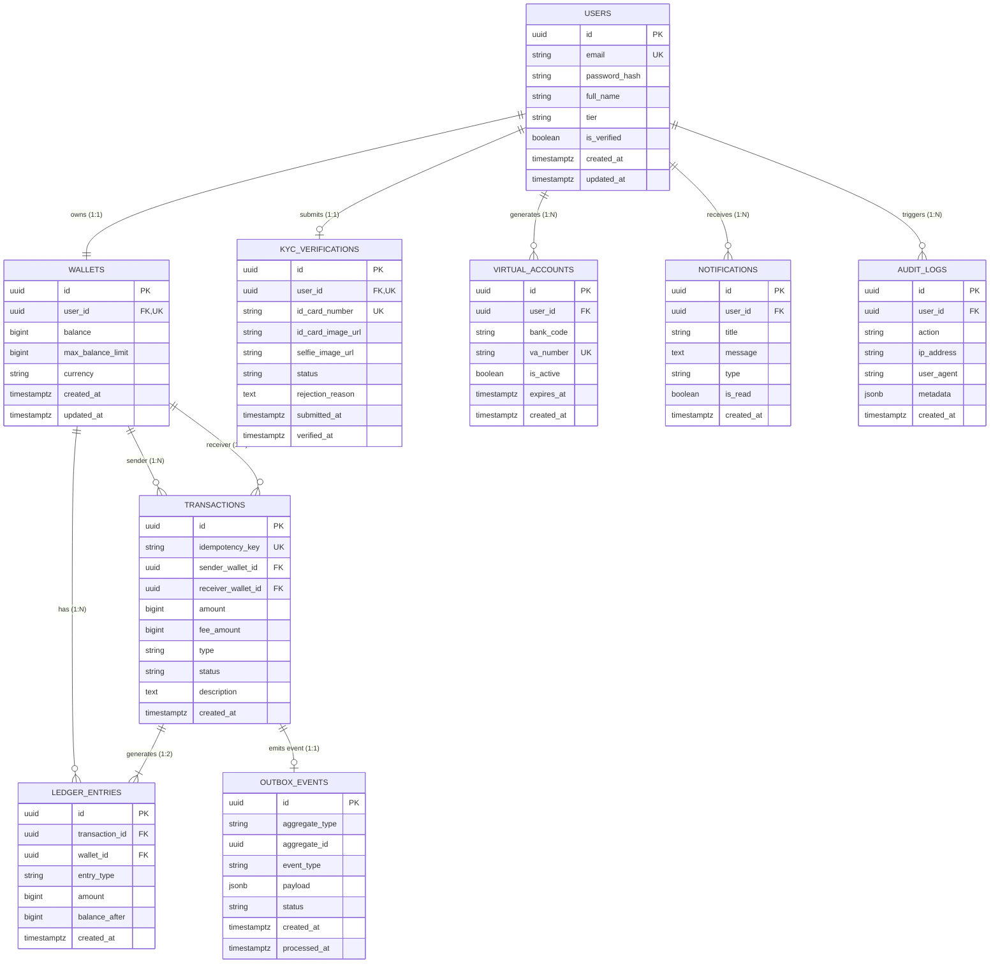

# 🗄️ Bastion — Enterprise Database Design & ERD

> **Source**: Derived from [prd.md](file:///c:/Projects/bastion/context/prd.md) & [features.md](file:///c:/Projects/bastion/context/features.md)
> **Database Engine**: PostgreSQL 16 (Relational DB) + Redis 7 (In-Memory Data Store)

---

## 1. Design Principles & Rules

| Principle | Rule / Impl | Reason |
|---|---|---|
| **Primary Keys** | `UUID` (v4) | Security against sequential ID guessing & safe for microservice distribution |
| **Monetary Amounts** | `BIGINT` | **Never use FLOAT/DECIMAL**. `Rp50.000` stored as `50000` integer rupiah |
| **Timestamps** | `TIMESTAMPTZ` | Always store in UTC standard; format to local time on presentation |
| **Immutability** | Append-only ledger | Transactions, Ledger entries, & Audit Logs are **never UPDATED or DELETED** |
| **Concurrency Lock** | Row-level locking | Use `SELECT ... FOR UPDATE` during balance mutations |
| **Double-Entry** | Balanced entries | Every successful transaction creates matching debit and credit entries |
| **Event Reliability** | Transactional Outbox Pattern | Save events into `outbox_events` in the SAME database transaction as business logic to guarantee *At-Least-Once* delivery to Kafka |
| **Regulated Limits** | KYC Tiering | Enforce Bank Indonesia E-Money limits: Tier 1 (Unverified) max Rp 2.000.000 balance; Tier 2 (Verified) max Rp 20.000.000 balance + P2P transfer rights |

---

## 2. Entity Relationship Diagram (ERD)



---

## 3. Schema Definitions & DDL SQL

### 3.1 `users`
Stores user profile, security state, and KYC tier status.

```sql
CREATE EXTENSION IF NOT EXISTS "pgcrypto";

CREATE TABLE IF NOT EXISTS users (
    id            UUID        PRIMARY KEY DEFAULT gen_random_uuid(),
    email         VARCHAR(255) UNIQUE NOT NULL,
    password_hash VARCHAR(255) NOT NULL,
    full_name     VARCHAR(255) NOT NULL,
    tier          VARCHAR(20) NOT NULL DEFAULT 'tier_1', -- 'tier_1' (Unverified), 'tier_2' (Verified KYC)
    is_verified   BOOLEAN     NOT NULL DEFAULT FALSE,
    created_at    TIMESTAMPTZ NOT NULL DEFAULT NOW(),
    updated_at    TIMESTAMPTZ NOT NULL DEFAULT NOW()
);

CREATE INDEX IF NOT EXISTS idx_users_email ON users(email);
```

### 3.2 `kyc_verifications`
Regulatory ID card verification records for upgrading user account limits.

```sql
CREATE TABLE IF NOT EXISTS kyc_verifications (
    id                 UUID        PRIMARY KEY DEFAULT gen_random_uuid(),
    user_id            UUID        UNIQUE NOT NULL REFERENCES users(id) ON DELETE CASCADE,
    id_card_number     VARCHAR(50) UNIQUE NOT NULL,
    id_card_image_url  VARCHAR(512) NOT NULL,
    selfie_image_url   VARCHAR(512) NOT NULL,
    status             VARCHAR(20) NOT NULL DEFAULT 'pending', -- 'pending', 'approved', 'rejected'
    rejection_reason   TEXT,
    submitted_at       TIMESTAMPTZ NOT NULL DEFAULT NOW(),
    verified_at        TIMESTAMPTZ
);

CREATE INDEX IF NOT EXISTS idx_kyc_user ON kyc_verifications(user_id);
```

### 3.3 `wallets`
Stores wallet balance, enforcing Bank Indonesia Tier balance limits.

```sql
CREATE TABLE IF NOT EXISTS wallets (
    id                 UUID        PRIMARY KEY DEFAULT gen_random_uuid(),
    user_id            UUID        UNIQUE NOT NULL REFERENCES users(id) ON DELETE CASCADE,
    balance            BIGINT      NOT NULL DEFAULT 0 CHECK (balance >= 0),
    max_balance_limit  BIGINT      NOT NULL DEFAULT 2000000 CHECK (max_balance_limit > 0), -- 2 Million for Tier 1, 20 Million for Tier 2
    currency           VARCHAR(3)  NOT NULL DEFAULT 'IDR',
    created_at         TIMESTAMPTZ NOT NULL DEFAULT NOW(),
    updated_at         TIMESTAMPTZ NOT NULL DEFAULT NOW(),
    CONSTRAINT chk_wallet_limit CHECK (balance <= max_balance_limit)
);

CREATE INDEX IF NOT EXISTS idx_wallets_user ON wallets(user_id);
```

### 3.4 `virtual_accounts`
Bank Virtual Accounts assigned for user wallet top-up processing.

```sql
CREATE TABLE IF NOT EXISTS virtual_accounts (
    id           UUID        PRIMARY KEY DEFAULT gen_random_uuid(),
    user_id      UUID        NOT NULL REFERENCES users(id) ON DELETE CASCADE,
    bank_code    VARCHAR(20) NOT NULL, -- 'BCA', 'MANDIRI', 'BRI', 'BNI'
    va_number    VARCHAR(50) UNIQUE NOT NULL,
    is_active    BOOLEAN     NOT NULL DEFAULT TRUE,
    expires_at   TIMESTAMPTZ,
    created_at   TIMESTAMPTZ NOT NULL DEFAULT NOW()
);

CREATE INDEX IF NOT EXISTS idx_va_number ON virtual_accounts(va_number);
```

### 3.5 `transactions`
Immutable historical record of transfers, top-ups, and payments.

```sql
CREATE TABLE IF NOT EXISTS transactions (
    id                 UUID        PRIMARY KEY DEFAULT gen_random_uuid(),
    idempotency_key    VARCHAR(255) UNIQUE NOT NULL,
    sender_wallet_id   UUID        REFERENCES wallets(id),
    receiver_wallet_id UUID        REFERENCES wallets(id),
    amount             BIGINT      NOT NULL CHECK (amount > 0),
    fee_amount         BIGINT      NOT NULL DEFAULT 0 CHECK (fee_amount >= 0),
    type               VARCHAR(50) NOT NULL, -- 'transfer', 'topup', 'payment'
    status             VARCHAR(50) NOT NULL DEFAULT 'pending', -- 'pending', 'success', 'failed'
    description        TEXT,
    created_at         TIMESTAMPTZ NOT NULL DEFAULT NOW()
);

CREATE INDEX IF NOT EXISTS idx_transactions_sender   ON transactions(sender_wallet_id, created_at DESC);
CREATE INDEX IF NOT EXISTS idx_transactions_receiver ON transactions(receiver_wallet_id, created_at DESC);
CREATE INDEX IF NOT EXISTS idx_transactions_idem_key ON transactions(idempotency_key);
```

### 3.6 `ledger_entries`
Double-entry accounting log (2 entries per valid transaction: 1 Debit, 1 Credit).

```sql
CREATE TABLE IF NOT EXISTS ledger_entries (
    id             UUID        PRIMARY KEY DEFAULT gen_random_uuid(),
    transaction_id UUID        NOT NULL REFERENCES transactions(id),
    wallet_id      UUID        NOT NULL REFERENCES wallets(id),
    entry_type     VARCHAR(10) NOT NULL, -- 'debit', 'credit'
    amount         BIGINT      NOT NULL CHECK (amount > 0),
    balance_after  BIGINT      NOT NULL CHECK (balance_after >= 0),
    created_at     TIMESTAMPTZ NOT NULL DEFAULT NOW()
);

CREATE INDEX IF NOT EXISTS idx_ledger_wallet ON ledger_entries(wallet_id, created_at DESC);
CREATE INDEX IF NOT EXISTS idx_ledger_tx     ON ledger_entries(transaction_id);
```

### 3.7 `outbox_events` (Transactional Outbox Pattern)
Guarantees reliable message publishing to Kafka without dual-write inconsistency risks.

```sql
CREATE TABLE IF NOT EXISTS outbox_events (
    id             UUID        PRIMARY KEY DEFAULT gen_random_uuid(),
    aggregate_type VARCHAR(100) NOT NULL, -- e.g., 'TRANSACTION', 'USER'
    aggregate_id   UUID        NOT NULL,
    event_type     VARCHAR(100) NOT NULL, -- e.g., 'PAYMENT_COMPLETED', 'KYC_APPROVED'
    payload        JSONB       NOT NULL,
    status         VARCHAR(20) NOT NULL DEFAULT 'pending', -- 'pending', 'published', 'failed'
    created_at     TIMESTAMPTZ NOT NULL DEFAULT NOW(),
    processed_at   TIMESTAMPTZ
);

CREATE INDEX IF NOT EXISTS idx_outbox_pending ON outbox_events(status, created_at ASC) WHERE status = 'pending';
```

### 3.8 `notifications`
User notifications populated by Kafka event consumers.

```sql
CREATE TABLE IF NOT EXISTS notifications (
    id         UUID        PRIMARY KEY DEFAULT gen_random_uuid(),
    user_id    UUID        NOT NULL REFERENCES users(id) ON DELETE CASCADE,
    title      VARCHAR(255) NOT NULL,
    message    TEXT        NOT NULL,
    type       VARCHAR(50) NOT NULL,
    is_read    BOOLEAN     NOT NULL DEFAULT FALSE,
    created_at TIMESTAMPTZ NOT NULL DEFAULT NOW()
);

CREATE INDEX IF NOT EXISTS idx_notifications_user_unread ON notifications(user_id, is_read, created_at DESC);
```

### 3.9 `audit_logs`
Security, device, and API action audit log for compliance.

```sql
CREATE TABLE IF NOT EXISTS audit_logs (
    id         UUID        PRIMARY KEY DEFAULT gen_random_uuid(),
    user_id    UUID        REFERENCES users(id) ON DELETE SET NULL,
    action     VARCHAR(100) NOT NULL, -- 'LOGIN', 'TRANSFER_INITIATED', 'KYC_SUBMITTED'
    ip_address VARCHAR(45)  NOT NULL,
    user_agent TEXT,
    metadata   JSONB,
    created_at TIMESTAMPTZ NOT NULL DEFAULT NOW()
);

CREATE INDEX IF NOT EXISTS idx_audit_user ON audit_logs(user_id, created_at DESC);
```

---

## 4. Redis Key Architecture

| Key Structure | Data Type | TTL | Purpose |
|---|---|---|---|
| `blacklist:{jwt_token}` | String (`"1"`) | Token exp | Token revocation on user logout |
| `idempotency:{idem_key}` | String (JSON) | 24 Hours | Caches transaction response to prevent duplicate payment processing |
| `rate_limit:{ip}:{endpoint}` | Counter Integer | 1 Minute | Prevents API abuse and brute force attacks |
| `wallet:cache:{user_id}` | String (JSON) | 60 Seconds | High-speed balance read caching |
