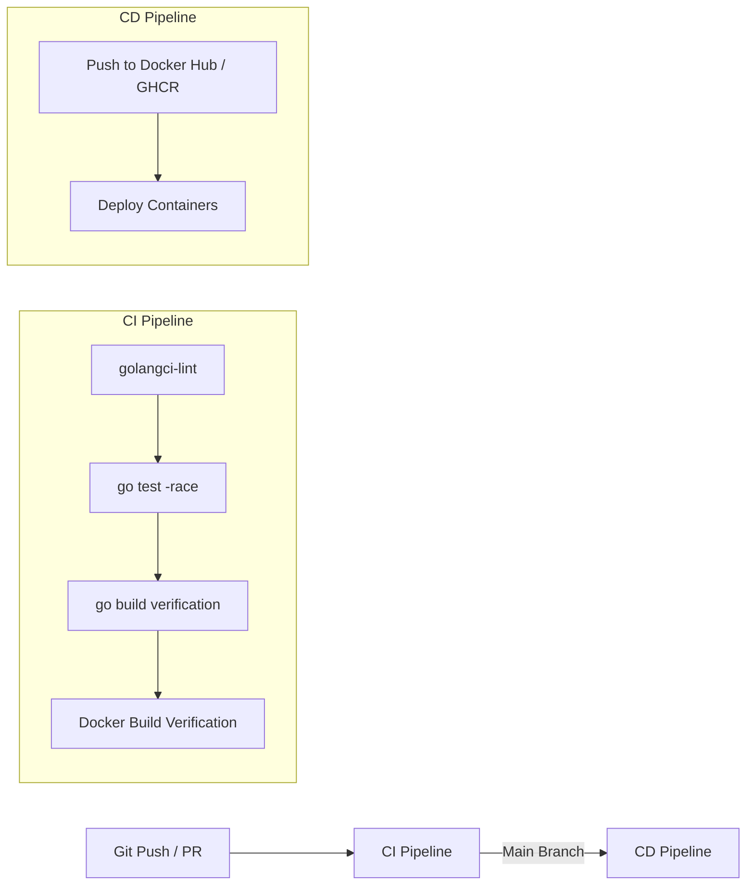

# 🛠️ Bastion — Tech Stack Overview

> **Source**: Derived from [prd.md](file:///c:/Projects/bastion/context/prd.md) & [architecture.md](file:///c:/Projects/bastion/context/architecture.md)

---

## 1. Tech Stack Summary Table

| Category | Technology | Version | Purpose in Bastion |
|---|---|---|---|
| **Backend Language** | **Go (Golang)** | `1.22+` | Core programming language across all backend microservices & gateway |
| **HTTP Framework** | **Gin** | `v1.9+` | Lightweight, fast HTTP framework for REST endpoints & API Gateway routing |
| **External API** | **RESTful API** | `v1` JSON | Public-facing JSON REST API for frontend & external client integration |
| **Relational Database** | **PostgreSQL** | `16-alpine` | Primary ACID-compliant database for users, wallets, transactions, & ledger |
| **In-Memory Cache** | **Redis** | `7-alpine` | Sub-millisecond store for JWT blacklist, idempotency keys, & rate limiting |
| **Event Streaming** | **Apache Kafka** | `7.5+` | Distributed message broker for event-driven asynchronous notifications |
| **Internal RPC** | **gRPC + Protobuf** | `v1.60+` | High-performance, strongly-typed binary communication between microservices |
| **Real-time Stream** | **WebSocket** | Standard | Full-duplex connection for pushing real-time payment alerts to clients |
| **Database Driver** | **pgx/v5** | `v5.5+` | High-performance PostgreSQL driver and connection pool (`pgxpool`) for Go |
| **Security & Auth** | **JWT + bcrypt** | Standard | Stateless authentication tokens & cost-12 password hashing |
| **CI/CD Pipeline** | **GitHub Actions** | Cloud | Automated linting, testing, Docker image building, & registry deployment |
| **Frontend UI** | **React + TypeScript**| `v18+` | Type-safe single page dashboard interface |
| **Containerization** | **Docker & Compose** | `3.9` | Container orchestration for all databases, services, and brokers |

---

## 2. Detailed Technical Explanations

### 🌐 RESTful API Architecture
- **Where Used**: API Gateway (`services/gateway`).
- **Characteristics**:
  - **JSON Payloads**: Standardized JSON format for all request and response bodies.
  - **HTTP Verbs**: Strict adherence to semantics (`GET` for reads, `POST` for creations/transfers, `PATCH` for partial updates).
  - **Versioned Routes**: `/api/v1/...` prefix for API backward compatibility.
  - **Standardized Errors**: Clear JSON error responses (`{"error": "message"}`).
  - **HTTP Status Codes**: `200 OK`, `201 Created`, `400 Bad Request`, `401 Unauthorized`, `403 Forbidden`, `404 Not Found`, `409 Conflict`, `422 Unprocessable Entity`, `429 Too Many Requests`.

---

### 🚀 CI/CD Pipeline (GitHub Actions)

Bastion uses **GitHub Actions** workflows for Continuous Integration & Continuous Deployment:

#### 1. Continuous Integration (`.github/workflows/ci.yml`)
- Triggered on every Push and Pull Request to `main`.
- Runs `golangci-lint` to enforce Go code quality and formatting.
- Executes unit & integration tests with race detector: `go test -race ./...`.
- Verifies that all Dockerfiles build cleanly.

#### 2. Continuous Deployment (`.github/workflows/cd.yml`)
- Triggered on merge/push to `main`.
- Builds tagged Docker images for `auth`, `wallet`, `notification`, and `gateway` services.
- Pushes images to GitHub Container Registry (`ghcr.io`).
- Triggers deployment to staging/production server.

---

### 🟢 Go (Golang)
- **Why**: Standard language for fintech platforms (Gojek, Xendit, Stripe, Grab).
- **Benefit**: Extremely low memory footprint, compiled speed, built-in concurrency with goroutines & channels.

### 🐘 PostgreSQL 16
- **Why**: Financial data demands 100% **ACID compliance**.
- **Benefit**: Row-level locking (`SELECT ... FOR UPDATE`), check constraints (`CHECK balance >= 0`), and JSONB support for outbox payloads and audit logs.

### 🔴 Redis 7
- **Why**: Ultra-fast key-value lookup.
- **Benefit**: Atomic key expiration (TTL) perfect for JWT logout blacklisting (24h TTL) and idempotency keys (24h TTL).

### ⚡ Apache Kafka & Transactional Outbox
- **Why**: Asynchronous event streaming to decouple services.
- **Benefit**: Transactional Outbox pattern guarantees *At-Least-Once* delivery so Kafka outages never fail monetary SQL transactions.

### 🔌 gRPC & Protocol Buffers
- **Why**: Internal microservice communication.
- **Benefit**: Binary serialization over HTTP/2 — up to 5x faster and lighter than traditional JSON over REST.

### 🐳 Docker & Docker Compose
- **Why**: Environment reproducibility.
- **Benefit**: A single `docker-compose up -d` command spins up PostgreSQL, Redis, Kafka, Microservices, and Frontend seamlessly.
