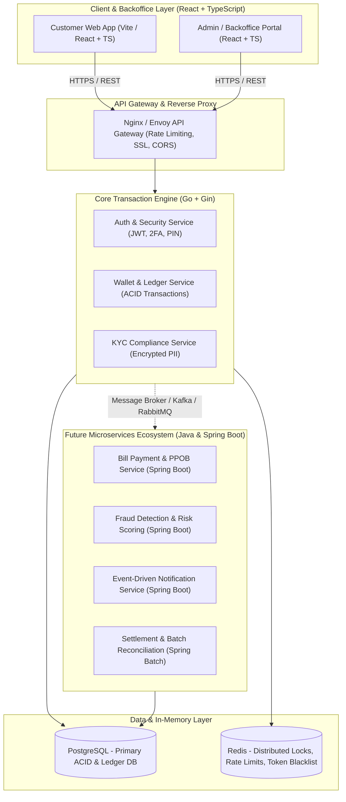
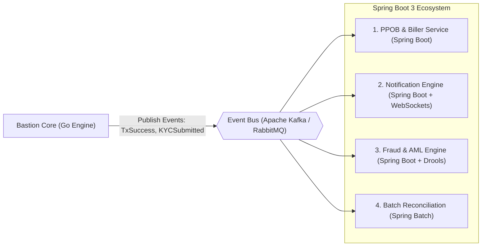
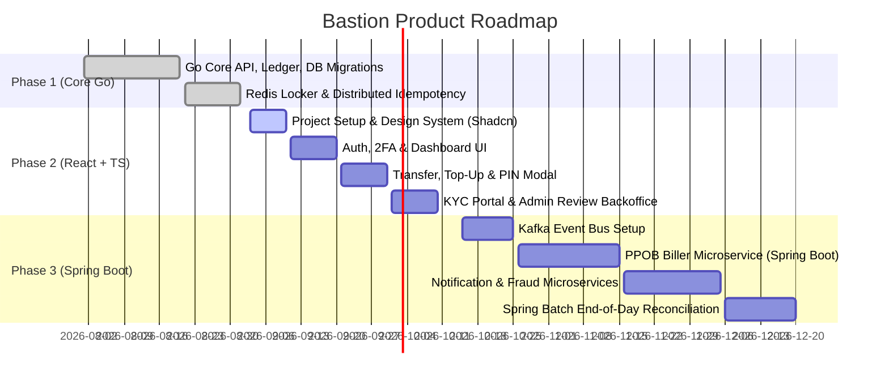

# Product Requirement Document (PRD)

**Project Name:** Bastion — High-Performance Fintech & Digital Wallet Engine  
**Document Version:** 1.0.0  
**Status:** Approved for Implementation  
**Target Platforms:** Go Backend (Core Engine), React + TypeScript (Frontend), Java & Spring Boot (Future Enterprise Microservices)

---

## 1. Executive Summary & Vision

### 1.1 Overview
**Bastion** is a high-performance, resilient, and enterprise-grade fintech backend engine and digital wallet platform. The system enforces strict financial consistency through **Double-Entry Bookkeeping**, distributed concurrency controls (Redis Locks), idempotency guarantees, and multi-tier regulatory compliance (Bank Indonesia standard balance limits).

### 1.2 Core Value Proposition
- **Zero-Drift Ledger:** Double-entry ledger architecture ensuring atomic debits and credits for all monetary movements.
- **Race Condition Immunity:** Redis-based distributed mutex locks preventing double-spending and balance inconsistencies under high concurrency.
- **Multi-Factor Financial Security:** Strict role-based access control (RBAC), bcrypt-hashed transaction PINs, TOTP 2FA (RFC 6238), data encryption at rest, and token blacklisting.
- **Extensible Hybrid Microservices Architecture:** High-throughput core engine in Go, rich client portal in React + TypeScript, and future enterprise service extensions in Java & Spring Boot (e.g., PPOB, recurring payments, fraud detection, batch reconciliation).

---

## 2. System Architecture Overview

---

## 3. User Personas & Roles (RBAC)

| Role | Description | Permissions & Privileges |
| :--- | :--- | :--- |
| **`USER` (Tier 1)** | Unverified new customer. | • View wallet balance. • Top-up wallet up to **IDR 2,000,000** limit. • Submit KYC documents. • Setup PIN & 2FA. • *Cannot transfer to other users.* |
| **`USER` (Tier 2)** | Fully KYC-verified customer. | • Max balance limit elevated to **IDR 10,000,000**. • Execute P2P transfers with mandatory PIN verification. • Full access to future billing and payment features. |
| **`KYC_REVIEWER`** | Compliance & Operations Officer. | • Review pending KYC document submissions (KTP + selfie). • Approve or reject KYC with auditable feedback. |
| **`ADMIN`** | System & Security Administrator. | • Full platform monitoring and Prometheus metrics inspection. • System-wide audit log inspection and account controls. |

---

## 4. Functional Requirements (FR)

### 4.1 Module 1: Identity, Authentication & Security (Go Core)
- **FR-1.1 (Registration & Login):** Secure registration with email validation and password hashing (bcrypt). Issues dual JWT tokens (Access Token + Refresh Token with rotation).
- **FR-1.2 (Rate Limiting):** IP and endpoint-specific rate limiting backed by Redis (e.g., max 3 register attempts/min, 5 login attempts/min).
- **FR-1.3 (Two-Factor Authentication - 2FA):** Support for RFC 6238 TOTP (Google Authenticator / Authy) setup, QR code generation, and login challenge verification.
- **FR-1.4 (Transaction PIN Management):** 6-digit numeric PIN setup and update, encrypted using application encryption keys and bcrypt hashing.
- **FR-1.5 (Audit Logging):** All critical events (login, KYC submission, transfer, PIN change) automatically recorded with user ID, IP address, user-agent, action, and JSON metadata.

### 4.2 Module 2: Core Digital Wallet & Balance (Go Core)
- **FR-2.1 (Automatic Wallet Provisioning):** Automatic creation of an active `IDR` wallet upon user registration with Tier 1 balance limits (IDR 2,000,000).
- **FR-2.2 (Balance Inquiries):** Real-time balance queries returning current balance, currency, tier level, and maximum allowed limit.
- **FR-2.3 (Tier Escalation):** Seamless automatic balance limit escalation from IDR 2,000,000 to IDR 10,000,000 upon KYC approval.

### 4.3 Module 3: Transaction Engine & Double-Entry Ledger (Go Core)
- **FR-3.1 (Idempotency Enforcement):** Mandatory `Idempotency-Key` HTTP header for state-changing operations (`/topup`, `/transfer`) to prevent duplicate transactions on network retries.
- **FR-3.2 (Distributed Mutex Locking):** Redis-based locks on wallet IDs during transfers and top-ups to prevent concurrent race conditions.
- **FR-3.3 (Double-Entry Ledger Invariant):**
  - **Top-Up:** Creates a `CREDIT` ledger entry on the user wallet.
  - **P2P Transfer:** Creates atomic `DEBIT` on sender wallet and `CREDIT` on receiver wallet within a single PostgreSQL ACID transaction.
- **FR-3.4 (PIN Verification for Outflows):** Transfers strictly require sender's 6-digit PIN before execution.
- **FR-3.5 (Transaction History):** Paginated transaction history with status filters (`SUCCESS`, `PENDING`, `FAILED`).

### 4.4 Module 4: KYC & Regulatory Compliance (Go Core)
- **FR-4.1 (Submission):** Users submit ID Card Number (KTP), ID card image URL, and selfie image URL.
- **FR-4.2 (PII Encryption):** Sensitive data (e.g., ID card numbers) encrypted using AES-GCM data encryption keys before persistence.
- **FR-4.3 (Backoffice Review Workflow):** Endpoints for `KYC_REVIEWER` / `ADMIN` to fetch pending verifications, approve them (escalating user to `tier_2`), or reject with a reason.

---

## 5. Frontend Application Specifications (React + TypeScript Ecosystem)

### 5.1 Technology Stack
- **Framework:** React 18+ with TypeScript (Vite-powered SPA or Next.js App Router).
- **State Management & Data Fetching:** TanStack Query (React Query v5) for cache synchronization, optimistic updates, and automatic token refresh interceptors.
- **UI Components & Design System:** Tailwind CSS + Shadcn UI (Radix UI primitives) + Lucide Icons.
- **Form Handling & Validation:** React Hook Form + Zod schema validation.
- **HTTP Client:** Axios with interceptors for `Authorization: Bearer <token>`, `Idempotency-Key` generation (UUIDv4), and automatic 401 refresh token handshake.

### 5.2 Frontend Pages & User Flows

#### A. Customer Web Application
1. **Authentication Flows:**
   - Sign In / Sign Up with inline password strength indicator.
   - 2FA Challenge Modal (TOTP 6-digit input).
2. **Dashboard / Home:**
   - Wallet card displaying current balance, Tier badge (`Tier 1 - Standard` vs `Tier 2 - Verified`), and quick actions (Top-up, Transfer, KYC).
   - Recent transaction list with instant status pills.
3. **Top-Up Modal / Screen:**
   - Quick amount chips (Rp 50k, Rp 100k, Rp 500k, Custom amount).
   - Balance limit progress bar (visualizing remaining tier limit capacity).
4. **P2P Transfer Flow:**
   - Recipient lookup by Wallet ID / Email.
   - Amount entry with real-time balance check.
   - **PIN Verification Sheet:** Secure virtual keypad / masked 6-digit PIN input with anti-tamper UX.
   - Transfer success receipt download / copy transaction reference.
5. **KYC Verification Center:**
   - Step-by-step wizard: KTP number input $\rightarrow$ ID photo upload $\rightarrow$ Selfie upload.
   - Status tracking card (`Pending Review`, `Approved`, `Rejected` with feedback).
6. **Security Settings:**
   - Change/Set PIN.
   - Enable/Disable 2FA with authenticator QR code reader.
   - Active Sessions & Audit Log history viewer.

#### B. Admin & KYC Reviewer Backoffice Portal
1. **KYC Review Queue:**
   - Side-by-side comparison view (ID card photo vs. user selfie).
   - One-click "Approve" (promotes user to Tier 2) or "Reject" (prompts reason dialog).
2. **Ledger & Audit Trail Inspector:**
   - Live double-entry ledger stream showing debit/credit balance reconciliation.
   - System audit logs search by user, IP address, and date range.

---

## 6. Future Microservices Roadmap (Java & Spring Boot)

When expanding the platform beyond the core Go ledger engine, the following enterprise microservices will be implemented using **Java 21 + Spring Boot 3**:

### 6.1 Future Spring Boot Feature Modules
1. **PPOB & Bill Payments Service (`bastion-biller-service`):**
   - Integration with external bill aggregators (PLN electricity tokens, PDAM water, cellular data packages, BPJS).
   - Spring WebClient for resilient downstream third-party REST integrations with Circuit Breaker (Resilience4j).
2. **Notification & Alert Engine (`bastion-notification-service`):**
   - Event-driven consumer listening to `transaction.completed`, `kyc.reviewed` Kafka events.
   - Dispatches transactional emails (Spring Mail / SendGrid), SMS OTPs, and WebPush/FCM notifications.
3. **Real-time Fraud & AML Detection Engine (`bastion-fraud-service`):**
   - Rule-based detection (Drools engine) analyzing velocity (e.g., > 5 transfers within 60s), unusual geographic locations, or high-value transfers.
   - Automatic account flagging or temporary freeze.
4. **End-of-Day Settlement & Reconciliation (`bastion-recon-batch`):**
   - Powered by **Spring Batch**.
   - Compares internal double-entry ledger totals against external payment gateway/bank settlement CSV statements.
   - Emits discrepancy reports to compliance admins.

---

## 7. Non-Functional Requirements (NFR)

### 7.1 Security & Compliance
- **Zero Plaintext PII:** ID cards and secrets encrypted using AES-256-GCM.
- **Secure Transport:** Strict HTTPS/TLS 1.3, Content Security Policy (CSP), and CORS whitelisting.
- **Anti-Tampering:** Rate limiting, Redis distributed mutex lock timeouts (5000ms TTL with auto-release), and short-lived JWTs (e.g., 2 hours).

### 7.2 Performance & Scalability
- **Sub-100ms API Latency:** Core ledger queries utilizing indexed PostgreSQL columns (`idx_wallets_user_id`, `idx_transactions_sender`, `idx_transactions_receiver`, `idx_ledger_entries_wallet`).
- **Connection Pool Optimization:** PgxPool configured with min 10 / max 50 connections with idle health checks.

### 7.3 Reliability & Observability
- **Prometheus Metrics:** Pre-configured `/api/v1/metrics` exposing request latency, error rates, and connection pool saturations.
- **Graceful Shutdown:** 5-second shutdown buffer ensuring pending financial transactions finish committing before container termination.

---

## 8. Release Roadmap & Milestones

